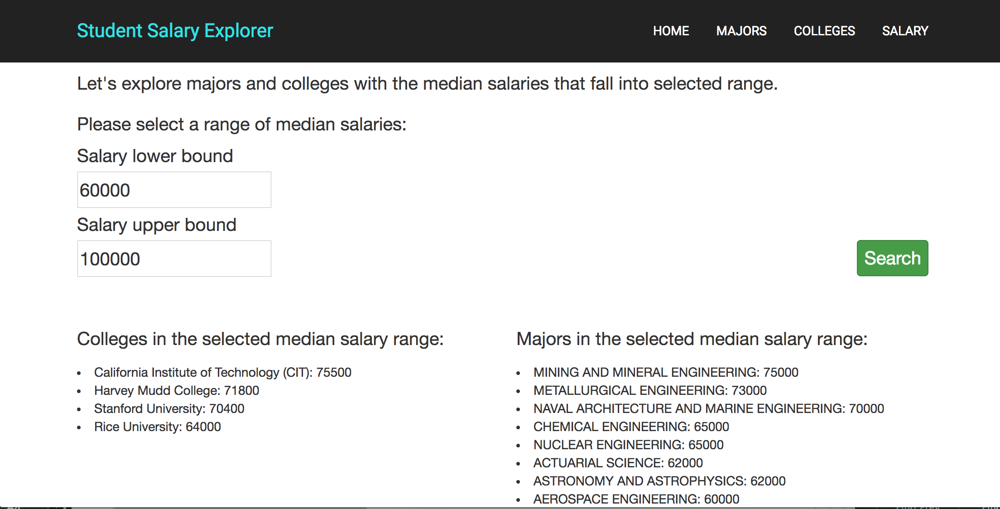
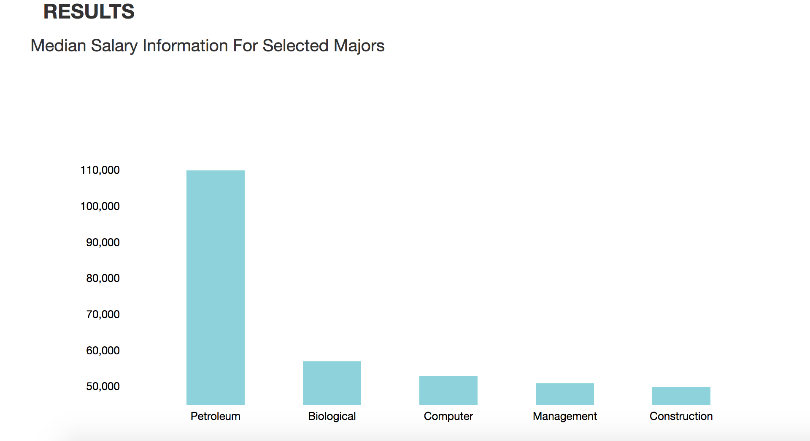
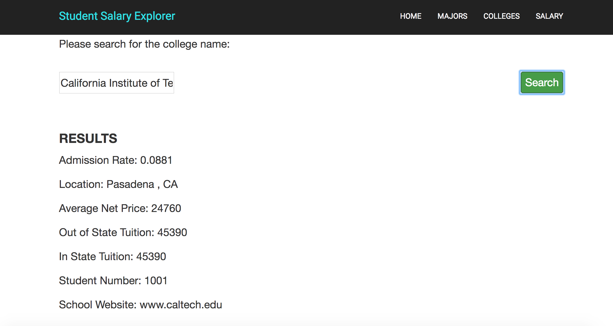

# Student Salary Explorer

MEAN app hosted on [Heroku](https://student-salary-explorer.herokuapp.com).

## Introduction
College seniors have a lot on their minds as their University education comes to a close revolving around what jobs to apply for, what salary they should accept, and where they would live. We recognize, however, that these choices are based upon previous ones: high school seniors are under tremendous stress to choose colleges and majors and these are the primary factors that will determine what a college senior’s job search looks like. With this in mind, we set out to make a tool for perspective college students. We focus on how salary data relates to college variables.

## Project goals
Our goal was to make accessible salary information based on colleges and other demographics. Because many people do not ask outright about salary information and social norms keep them from being vocal about these questions, we wanted to make this information accessible. Providing simple information was not enough, we wanted to include many different factors that went into post-grad salary. We combined many data sets to provide easy access to lots of different information.

## Basic Architecture
We built a MEAN stack (NodeJS, AngularJS, Mongo, Express) web page hosted locally. We used Node to create APIs that enable the Angular frontend to get access to our data in both our mySQL database and our Mongo database. We used the d3.js library in the Angular controllers for data visualization and implemented basic HTML and CSS files for the foundation of the page. All pages share the basic structure in index.html. We used ng-include to insert the footer and the navigation bar. On top of this basic html structure, we insert separate Angular views for different app features. The views include “by salary”, “by major” and “by college”, which can be accessed from the navigation bar and associated with their own controllers.
server.js: Node backend that starts the server, connects to both Mongo and mySQL databases and defines the APIs that talk to the databases.
public/app/controllers: byCollegeCtrl.js, byMajorCtrl.js, bySalaryCtrl.js and mainCtrl.js are AngularJS controllers used for each page.
public/app/services: Angular services and factories used for utility functions shared by all controllers.
public/app/routes.js: ngRoute file that directs each URL to its corresponding views and controllers.
public/assets: external javascript files and css files.
report/: our project report and screenshots used for the writeup.
package.json: defines the dependencies, starting scripts and meta information.

## Selected Screenshots

